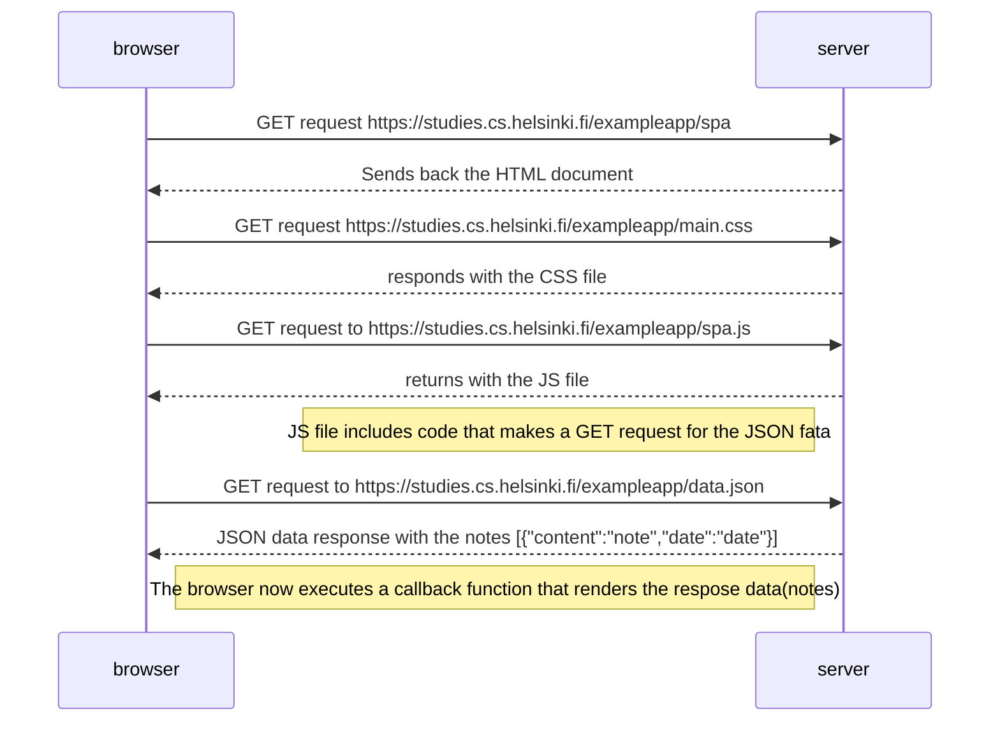

```mermaid
	sequenceDiagram
	participant browser
	participant server
	
	browser ->> server: GET request https://studies.cs.helsinki.fi/exampleapp/spa
	
	server -->> browser: Sends back the HTML document


	browser ->> server: GET request https://studies.cs.helsinki.fi/exampleapp/main.css 
	server -->> browser: responds with the CSS file

	browser ->> server: GET request to  https://studies.cs.helsinki.fi/exampleapp/spa.js
	server -->> browser: returns with the JS file 
	Note left of server: JS file includes code that makes a GET request for the JSON fata

	browser ->> server: GET request to https://studies.cs.helsinki.fi/exampleapp/data.json
	server -->> browser: JSON data response with the notes [{"content":"note","date":"date"}]

Note right of browser: The browser now executes a callback function that renders the respose data(notes)
```
