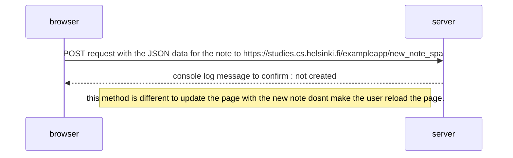

```mermaid
sequenceDiagram
participant browser
participant server


browser ->> server: POST request with the JSON data for the note to https://studies.cs.helsinki.fi/exampleapp/new_note_spa

server -->> browser: console log message to confirm : not created

Note left of server : this method is different to update the page with the new note dosnt make the user reload the page.

```
